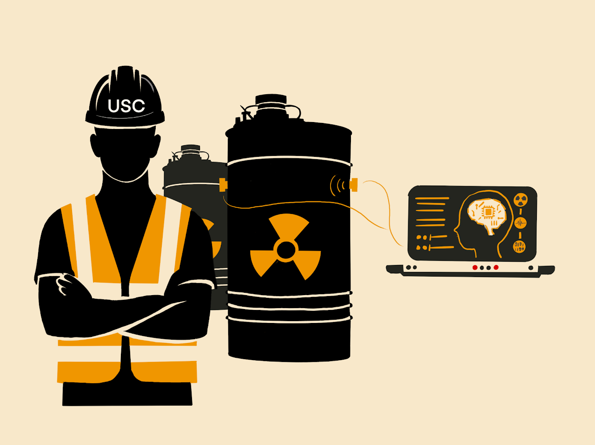

# PhD Dissertation Code Repository

Welcome to my PhD Dissertation Code Repository. This repository contains the Matlab and Python codes developed as part of my research conducted for the dissertation. The repository is organized by chapters, with each folder containing the relevant code and resources.

Link to Dissertation: http://libproxy.usc.edu/login?url=https://www.proquest.com/dissertations-theses/impurity-gas-detection-spent-nuclear-fuel-snf/docview/3099366799/se-2?accountid=14749

8th Annual Regional 3-Minute Thesis® Competition 
(copyright © Bozhou Zhuang)

## Contents

### Chapter 4: Active Noise Cancellation (ANC) Method
- **Description:** Matlab codes implementing the ANC method introduced in Chapter 4.
- **Repository Link:** [Chapter 4 ANC Method](https://github.com/bozhouzh/PhD_Dissertation/tree/main/Chapter_4)
- **Paper:** https://doi.org/10.1016/j.ymssp.2023.110330

### Chapter 5: Artificial Neural Networks (ANN) and Convolutional Neural Networks (CNN)
- **Description:** Python codes for ANN and CNN models introduced in Chapter 5, focusing on ultrasonic sensing data analysis.
- **Repository Link:** [Chapter 5 ANN and CNN](https://github.com/bozhouzh/PhD_Dissertation/tree/main/Chapter_5)
- **Paper:** https://doi.org/10.1016/j.measurement.2023.113822

### Chapter 6: Probabilistic CNNs and Ensemble CNNs
- **Description:** Python codes for probabilistic CNNs and ensemble CNNs discussed in Chapter 6, emphasizing advanced deep learning approaches.
- **Repository Link:** [Chapter 6 Probabilistic CNNs and Ensemble CNNs](https://github.com/bozhouzh/PhD_Dissertation/tree/main/Chapter_6)
- **Paper:** http://dx.doi.org/10.2139/ssrn.4675917

### Chapter 7: Variational Auto-Encoders (VAE) and Wasserstein Auto-Encoders (WAE)
- **Description:** Python codes for VAE and WAE developed in Chapter 7.
- **Repository Link:** [Chapter 7 VAE and WAE](https://github.com/bozhouzh/PhD_Dissertation/tree/main/Chapter_7)
- **Paper:** Under Review with Structural Health Monitoring.
  
## Additional Resources

Readers are encouraged to explore these repositories to access the full code and related resources. Data will be available upon request. Other papers from my Ph.D. include:

- **Paper:** http://dx.doi.org/10.2139/ssrn.4711714
- **Paper:** https://doi.org/10.1016/j.engappai.2023.107484
- **Paper:** https://doi.org/10.1117/12.3007502

For more information about the author and the research, please visit the [personal website](https://sites.google.com/usc.edu/bozhouzhuang/home).

---

Feel free to reach out with any questions or feedback regarding the code or my research work at bozhouzh@usc.edu.
